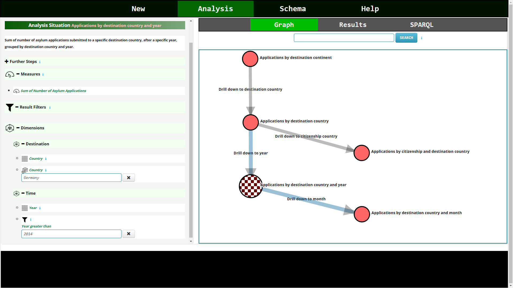

# Semantic Web Analysis Graphs

The linked open data (LOD) comprises thousands of data sets and billions of triples of different domains, which represent an important resource of knowledge for Multidimensional (MD) analysis.
Modelling data according to the multidimensional (MD) data model render these data accessible to MD and online analytical processing (OLAP) analysis.
The QB4OLAP vocabulary serves to represent MD data on the semantic web.
Furthermore, non-MD data can be rendered accessible to MD analysis via superimposition of MD schemas.

There is a variety of users who may be interested in conducting MD analysis over LOD sources, e.g., ordinary people and non-governmental organizations.
Although there have been efforts to represent MD data over LOD, e.g., QB4OLAP, there is still a lack of tools that allow the MD analysis of these data.
Users who are willing to make MD analysis of LOD sources face various obstacles.
First, prospective users are likely to lack technical skills to conduct an analysis, e.g., dealing with RDF and SPARQL.
Second, these user are also unlikely to have the sufficient analytical domain knowledge to know which analytical processes can be interesting or sense-making.

Semantic web analysis graphs (SWAG) allow to model and execute analytical processes over the semantic web allowing to proactively model generic, best-practice analytical processes. 
Modeling analytical processes with SWAGs allows for the creation of guided MD analysis tools, which allow users to tailor template analytical processes to their requirements.
Representation and sharing of analytical knowledge come, for free, as side-effects of the SWAG approach.

As the name suggests, a SWAG is a graph where nodes are analysis situations and edges are navigation steps that connect analysis situations.
An analysis situation can be seen as a high-level representation of a generic MD query.
A navigation step is a set of generic OLAP operations that, when applied to a source analysis situation, transform it into a target analysis situation.
Analysis situations and navigation steps utilize high-level MD constructs that only refer to MD elements, OLAP terminology, and domain concepts, which spare user the need to deal with low-level details.
Analysis situations and navigation steps are generic in the sense that they can be parameterized with variables, unknown values to be determined by user during the course of instantiation, which fosters reusability and customizability.

# Implementation

We have employed semantic web analysis graphs as a foundation to develop a guided OLAP analysis tool for LOD sources.
Semantic web recommendations (RDF and RDFS) serve to represent and publish SWAGs.
Whereas QB and QB4OAP vocabularies are employed as the underlying MD data model, SPARQL serves as the underlying query language against LOD sources.
The SWAG vocabulary defines RDF classes and properties used to represent and publish concrete SWAGs.
SWAG vocabulary refers to elements from QB4OLAP vocabulary and concrete SWAGs refer to elements from an MD schema represented using QB4O vocabulary.
Other LOD sources, no represented using QB4OLAP, can also be employed within SWAG via, e.g., superimposition.
Furthermore, domain-specific business terms can be referenced within a SWAG as well to allow for the expression of domain-specific predicates.

We have implemented a proof-of-concept prototype of SWAG as a Java dynamic web application.
Image below shows the architecture of the system.
HTML, JavaScript, jQuery, d3, and AJAX are employed for the frontend.
Handling web requests and responses is handled via the controller.
The SWAG Manager module coordinates other modules.
The Execution Engine conducts the main logic of SWAG.
Reading RDF data, sending SPARQL queries, and obtaining results is carried out by the Data Handler module, where Apache Jena libraries are employed.
Generation of SPARQL queries is done by the SPARQL Generator module, which uses Apache Jena ARQ libraries for that purpose.

The image below is a screenshot from the prototype. For a demo of the prototype, refer to [demo](demo.md)
The prototype depicts a particular SWAG using bird's eye view.
Whereas circles represent analysis situations, directed edges are navigation steps.
Details panel serves to display details of the selected analysis situation or navigation step.
User can provide values for the situation's variables supported by auto-completion.
As soon as the variables of an analysis situation are bound, it is possible to view its results, as well as selecting an outgoing navigation step to proceed with.
Once a navigation step is selected, user can bind its variables, and then navigate to the target situation and view its results.

